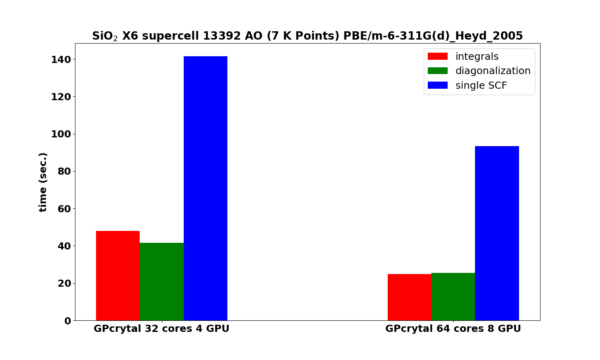

# gpu-diagonalizer
This repository contains a modified version of the diag_lapack.f library to offload on GPUs linear algebra operations.
The offloading strategy reported here is based on OpenACC directives.

# Leonardo GPU partition scaling

*Leonardo booster module computing time using one and two nodes, for a supercell of SiO2 containing 648 atoms and 13392 atomic orbitals. SCF performed at PBE/m-6-311G(d)_Heyd_2005 level of theory.*
